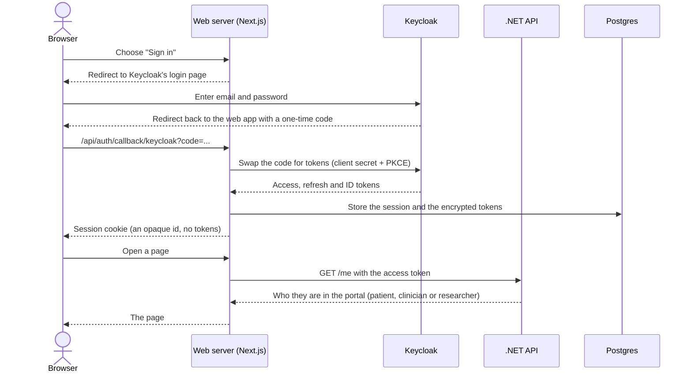

# Keycloak in the Patient Portal

This guide explains how the portal uses Keycloak. If you only want the decisions and the reasons behind them, read
[ADR 0003](adr/0003-authentication-and-authorization.md). This page is the tutorial that explains the words in it.

## The short version

- **Keycloak is the only place passwords live.** The portal never sees or stores one. People type their password on a
  Keycloak page, not on ours.
- **Keycloak answers two questions:** _who is this person?_ and _what broad kind of user are they?_ (patient,
  clinician, researcher or admin).
- **Keycloak does not decide who may see which patient's data.** The API decides that from its own database: treatment
  relationships and consents.
- **After sign-in, Keycloak hands the web app a signed token.** The web app keeps it on the server and attaches it to
  every call to the API. The browser never sees it.
- **The API trusts the token because Keycloak signed it**, and checks the signature without contacting Keycloak on every
  request.

## Why use Keycloak at all?

A patient portal holds health data, so the sign-in has to be right: hashed passwords, brute-force protection, session
handling, password resets, and later maybe two-factor login. Building that ourselves is a large, risky project that has
nothing to do with lab results. Keycloak is a ready-made, widely used **identity provider**: a service whose whole job is
to sign people in and vouch for who they are. We hand that job over and keep the portal focused on records and consent.

## Keycloak words in plain language

| Word                                  | What it means                                                                                                                                      | In this app                                                        |
| ------------------------------------- | -------------------------------------------------------------------------------------------------------------------------------------------------- | ------------------------------------------------------------------ |
| **Identity provider**                 | The service that checks who you are.                                                                                                               | Keycloak, at `http://localhost:8080`.                              |
| **Realm**                             | A separate space with its own users, roles and settings, like one company's account in a shared product.                                           | One realm, `patient-portal`.                                       |
| **User**                              | A person who can sign in.                                                                                                                          | The demo accounts (Emily, Sarah, Laura and so on).                 |
| **Role**                              | A label on a user that says what kind of user they are.                                                                                            | `patient`, `clinician`, `researcher`, `admin`.                     |
| **Client**                            | An application that is allowed to ask Keycloak to sign people in.                                                                                  | `portal-web` (our web app) and `portal-dev-tools` (local scripts). |
| **OAuth 2.0 / OpenID Connect (OIDC)** | The standard conversation between an application and an identity provider. OIDC adds "who is this?" on top of OAuth's "what may this app do?".     | How `portal-web` talks to Keycloak.                                |
| **Authorization code flow**           | The OIDC sign-in route where the browser is sent to Keycloak, comes back with a short-lived _code_, and the web server swaps that code for tokens. | The flow we use.                                                   |
| **PKCE**                              | An extra safeguard on that code swap, so a stolen code is useless.                                                                                 | Switched on for `portal-web`.                                      |
| **Token**                             | A small signed package of facts that proves something.                                                                                             | See below.                                                         |
| **JWT**                               | The format our access tokens use: three base64 parts (header, payload, signature) joined by dots.                                                  | What the API reads.                                                |
| **Claim**                             | One fact inside a token, such as the user's id or roles.                                                                                           | `sub`, `iss`, `aud`, `realm_access`, and more.                     |
| **Issuer (`iss`)**                    | Who created the token. The API only accepts tokens from Keycloak's realm.                                                                          | `http://localhost:8080/realms/patient-portal`                      |
| **Audience (`aud`)**                  | Who the token is meant for. A token for another app is refused.                                                                                    | `portal-api`                                                       |
| **Subject (`sub`)**                   | The user's permanent, unique id in Keycloak.                                                                                                       | Links a login to a patient, clinician or researcher row.           |

### The three kinds of token

| Token             | Purpose                                                                                              | Lifetime here    | Who holds it         |
| ----------------- | ---------------------------------------------------------------------------------------------------- | ---------------- | -------------------- |
| **Access token**  | Shown to the API to prove who is calling.                                                            | About 5 minutes. | The web server only. |
| **Refresh token** | Gets a fresh access token without asking the person to sign in again.                                | Longer.          | The web server only. |
| **ID token**      | Tells the web app who just signed in. The API rejects it, because it is addressed to the web client. | Short.           | The web server only. |

Short-lived access tokens limit the damage if one ever leaks. The refresh token is what keeps people signed in.

## What is set up for us

Keycloak is configured by one file, [`keycloak/realm-export.json`](../keycloak/realm-export.json), which Keycloak imports
when it starts (see the `keycloak` service in [`docker-compose.yml`](../docker-compose.yml)). Nothing needs clicking
through the admin console.

**The realm `patient-portal`** has sign-up turned off, so the only accounts are the ones in the file, and allows signing
in with an email address.

**Four realm roles:** `patient`, `clinician`, `researcher` and `admin`. `admin` exists for managing treatment
relationships through the API. It has no patient, clinician or researcher record, so it sees a "no portal access" page
in the web app.

**Two clients:**

| Client             | Who uses it                                                                  | Key settings                                                                                                                                                               |
| ------------------ | ---------------------------------------------------------------------------- | -------------------------------------------------------------------------------------------------------------------------------------------------------------------------- |
| `portal-web`       | The Next.js web app, acting on behalf of a signed-in person.                 | _Confidential_: it has a client secret that only the web server knows. Authorization code flow with PKCE. Only `http://localhost:3000/*` may receive the sign-in redirect. |
| `portal-dev-tools` | Local scripts and tests that need a token for a demo user without a browser. | _Public_ with direct username and password login. **Development only.**                                                                                                    |

Both clients carry an **audience mapper** that adds `portal-api` to the access token's `aud` claim. Without it the API
would refuse the token.

**Demo users** carry exactly one role each. Their list and shared password are in the [README](../README.md).

## Signing in, step by step



1. **You choose Sign in.** A server action asks the auth library (Better-Auth) for Keycloak's sign-in address and
   redirects your browser there.
2. **You type your password on Keycloak's page.** The portal is not involved, so it cannot leak or mishandle it.
3. **Keycloak sends your browser back** to `http://localhost:3000/api/auth/callback/keycloak` with a one-time
   _authorization code_ in the address. The code alone is worthless.
4. **The web server swaps the code for tokens**, in a direct server-to-server request to Keycloak. It proves its identity
   with its client secret and the PKCE proof. The browser is not part of this step, which is why the tokens never pass
   through it.
5. **The web server stores the result in Postgres:** a session, plus the access and refresh tokens encrypted at rest (the
   `web_*` tables, written by a database role that can reach nothing else).
6. **Your browser receives only a session cookie**, an opaque id that means nothing on its own.
7. **The web app asks the API who you are** (`GET /me`), using the access token. The answer decides which part of the
   portal you see.

## After sign-in: every request

The browser only ever talks to the web server. For each page, the web server:

1. Reads the session cookie and finds your session in Postgres.
2. Takes the stored access token. If it has expired (every five minutes or so), it quietly uses the refresh token to get
   a new one.
3. Calls the API with the header `Authorization: Bearer <access token>`.
4. Turns the API's answer into the page.

This pattern is called a **backend for frontend** (BFF). The benefit: even if someone injects a script into the page,
there is no token in the browser to steal. It is also why the code may never call the API from the browser, and why
server actions check the session themselves, since anyone can call them directly.

`web/proxy.ts` only bounces visitors who have no session cookie to the sign-in page. The real checks happen in the layouts
and actions.

## How the API trusts a token

The API never asks Keycloak "is this token real?". It checks the token itself:

| Check                                                                  | What it proves                                                                                                                 |
| ---------------------------------------------------------------------- | ------------------------------------------------------------------------------------------------------------------------------ |
| **Signature**, against Keycloak's public keys                          | Keycloak created it and nobody changed it. The keys come from Keycloak's published key list (the JWKS address) and are cached. |
| **Issuer** is our realm                                                | It came from the right Keycloak realm.                                                                                         |
| **Audience** is `portal-api`                                           | It was meant for this API, not another application.                                                                            |
| **Expiry** has not passed (30 seconds of leeway for clock differences) | It is still fresh.                                                                                                             |

If any check fails, the API answers `401`. The API keeps no sessions and stores no logins, so it is a stateless
_resource server_.

Keycloak lists the user's roles inside the token, under `realm_access`. The API copies them into ordinary .NET roles, so
rules such as `RequireRole("patient")` work. An access token for a clinician looks like this, trimmed to the claims the
portal uses:

```json
{
  "iss": "http://localhost:8080/realms/patient-portal",
  "aud": "portal-api",
  "sub": "90000000-0000-0000-0000-000000000003",
  "preferred_username": "sarah.thompson@demo.example",
  "realm_access": { "roles": ["clinician"] },
  "exp": 1790000300
}
```

## Linking a login to a record

Keycloak knows _people_. The portal's database knows _patients, clinicians and researchers_. The link is the token's
`sub`, which is stored as `external_subject_id` on each patient, clinician and researcher row.

`GET /me` looks that id up and answers "patient Emily Carter, id `b000…`" (or clinician, or researcher). The web app then
uses that id in the API routes it calls, such as `/patients/{id}/lab-results`. A login with no matching row, like the admin
account, gets a "no portal access" page.

## What Keycloak decides, and what it does not

This is the most important boundary in the design.

| Question                                                                              | Decided by   | How                                                                                                               |
| ------------------------------------------------------------------------------------- | ------------ | ----------------------------------------------------------------------------------------------------------------- |
| Is this person who they say they are?                                                 | **Keycloak** | Password check on its own page.                                                                                   |
| What kind of user is this?                                                            | **Keycloak** | Realm role in the token.                                                                                          |
| Is this caller the person named in the URL (`/patients/{id}`)?                        | **The API**  | Token `sub` matched to the row's `external_subject_id`.                                                           |
| May this clinician or researcher read _this patient's_ results, and which categories? | **The API**  | An active treatment relationship, or a consent, in Postgres. Checked on every read and recorded in the audit log. |

A role such as `clinician` only says which doors to try. It never opens a patient's record by itself. That is deliberate:
roles are coarse, records are personal, and consent can change minute by minute.

## Signing out

Signing out ends the portal session **and** Keycloak's own session, so the next Sign in asks for a password again. The web
server clears its session, then sends the browser to Keycloak's logout address, which returns to `/login`.

## Running and exploring it locally

`./dev.sh` (or `docker compose up`) starts Keycloak in **development mode** on <http://localhost:8080>. That mode uses
plain HTTP and is for development only.

**Look around the admin console:**

1. Open <http://localhost:8080> and sign in with `KEYCLOAK_ADMIN_USER` and `KEYCLOAK_ADMIN_PASSWORD` from your `.env`.
2. Use the realm picker at the top left and choose **patient-portal**. The default `master` realm is Keycloak's own admin
   space.
3. **Users** lists the demo accounts, and each one's role is under _Role mapping_. **Clients** shows `portal-web` and
   `portal-dev-tools`. **Realm roles** lists the four roles.

**Get a token yourself** (development only, using the dev-tools client and a demo account from the README):

```sh
TOKEN=$(curl -s \
  -d grant_type=password -d client_id=portal-dev-tools \
  -d username=sarah.thompson@demo.example -d password=demo-password \
  http://localhost:8080/realms/patient-portal/protocol/openid-connect/token \
  | python3 -c 'import sys,json; print(json.load(sys.stdin)["access_token"])')

curl -H "Authorization: Bearer $TOKEN" http://localhost:5246/me
```

To read the claims, decode the middle part locally. Do not paste real tokens into websites:

```sh
python3 -c 'import sys,base64,json; p=sys.argv[1].split(".")[1]; print(json.dumps(json.loads(base64.urlsafe_b64decode(p+"="*(-len(p)%4))),indent=2))' "$TOKEN"
```

**Changing the setup:** edit `keycloak/realm-export.json` and re-import it (`./dev.sh reset` wipes the local data and
imports again; see the README). Changes made in the admin console are not written back to that file.

## Configuration reference

| Where                                     | Setting                                                     | Why it matters                                                                                                                                      |
| ----------------------------------------- | ----------------------------------------------------------- | --------------------------------------------------------------------------------------------------------------------------------------------------- |
| `docker-compose.yml`                      | `KC_HOSTNAME=http://localhost:8080`                         | Fixes the **issuer** written into every token, however the request reached Keycloak.                                                                |
| `docker-compose.yml`                      | `KC_HOSTNAME_BACKCHANNEL_DYNAMIC=true`                      | Lets server-to-server addresses (such as the key list) follow whoever is asking: `keycloak:8080` inside Docker, `localhost:8080` from your machine. |
| `.env`                                    | `KEYCLOAK_ADMIN_USER`, `KEYCLOAK_ADMIN_PASSWORD`            | The first admin account for the console.                                                                                                            |
| `.env`                                    | `KEYCLOAK_PORTAL_WEB_SECRET`                                | The `portal-web` client secret. Keep it out of the browser and out of commits.                                                                      |
| `web/.env.local`                          | `KEYCLOAK_ISSUER`, `KEYCLOAK_CLIENT_SECRET`                 | How the web server finds Keycloak and proves it is `portal-web`.                                                                                    |
| `api/PatientPortal.Api/appsettings*.json` | `Authentication:MetadataAddress`, `ValidIssuer`, `Audience` | Where the API fetches Keycloak's keys, and what it demands of a token.                                                                              |

## Common problems

| Symptom                                               | Likely cause and fix                                                                                                                                                                |
| ----------------------------------------------------- | ----------------------------------------------------------------------------------------------------------------------------------------------------------------------------------- |
| The API answers `401` though you are signed in.       | The token's issuer does not match `ValidIssuer`. Reach Keycloak as `http://localhost:8080` everywhere on your machine. A different hostname makes Keycloak write a different `iss`. |
| Keycloak shows "Invalid redirect URI".                | The web app is not at `http://localhost:3000`. Only that address is allowed for `portal-web`.                                                                                       |
| Signing in as a second person logs the first one out. | Keycloak keeps one sign-in per browser. Use a private window.                                                                                                                       |
| You sign in and see "no portal access".               | The login has no matching patient, clinician or researcher row. Expected for `admin@demo.example`.                                                                                  |
| A new user cannot sign in to anything useful.         | Keycloak only proves who they are. Add a row with their `sub` as `external_subject_id`, or they have no record to open.                                                             |
| Keycloak never becomes ready.                         | Give it about 30 seconds on first start. `./dev.sh` waits for its health check.                                                                                                     |

## Where to look in the code

| What                                                     | File                                                                             |
| -------------------------------------------------------- | -------------------------------------------------------------------------------- |
| The realm: roles, clients, demo users                    | `keycloak/realm-export.json`                                                     |
| Keycloak container and hostname settings                 | `docker-compose.yml`                                                             |
| The web app as an OIDC client (Better-Auth)              | `web/lib/auth.ts`                                                                |
| Sign in and sign out actions                             | `web/features/auth/actions.ts`                                                   |
| Who is signed in, and page and action guards             | `web/features/auth/session.ts`, `web/features/auth/repository.ts`                |
| Sending the token to the API                             | `web/lib/api/server.ts`                                                          |
| Redirect when there is no session cookie                 | `web/proxy.ts`                                                                   |
| The API validating the token and reading roles           | `api/PatientPortal.Api/Infrastructure/Auth/AuthenticationSetup.cs`               |
| Route rules: role plus "acting as" the person in the URL | `api/PatientPortal.Api/Infrastructure/Auth/AuthorizationSetup.cs`, `ActingAs.cs` |
| Treatment and consent access to a patient's results      | `api/PatientPortal.Api/Infrastructure/Auth/PatientRecordAccess.cs`               |
| Linking a login to a record                              | `api/PatientPortal.Api/Features/Me/GetMe.cs`                                     |

## Glossary

- **Access token**: short-lived proof, shown to the API on every call.
- **Authentication**: proving who you are. Keycloak does this.
- **Authorization**: deciding what you may do. Split here: roles from Keycloak, record access from the API.
- **BFF (backend for frontend)**: a server that sits between the browser and the API and holds the tokens.
- **Confidential client**: an application that can keep a secret, such as a web server. A browser-only app cannot.
- **Identity provider**: a service that signs people in and vouches for them.
- **JWKS**: the list of public keys Keycloak publishes so others can verify its signatures.
- **Refresh token**: a longer-lived token used only to obtain new access tokens.
- **Resource server**: an API that accepts tokens and serves data. It does not sign anyone in.
